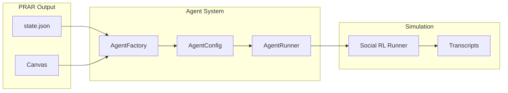

# Agent System

This directory contains the agent infrastructure for transforming PRAR canvas definitions into executable simulation participants.

## Status

**Phase 1: Complete** - Core agent layer implemented and integrated with Social RL framework.

## Architecture

The agent layer bridges PRAR (design phase) to simulation (execution phase):



## Directory Structure

```
agents/
├── agent_config.py       # AgentConfig, AgentResponse, RoundConfig dataclasses
├── agent_factory.py      # Factory for instantiating agents from canvas
├── agent_runner.py       # Runtime for executing multi-agent simulations
├── __init__.py
├── ces_generators/       # CES-to-agent transformation (COMPLETE)
│   ├── grit_config.py    # Tiered grit constraints (NONE/LIGHT/MODERATE/STRONG)
│   ├── identity_metrics.py
│   └── row_to_agent.py
├── identity_core/        # Identity mechanics (COMPLETE - Phase 2a)
│   ├── core.py           # Full IdentityCore class (791 lines)
│   └── tau.py            # Emergent time computation
└── README.md
```

## Core Components

### AgentConfig

Configuration dataclass for simulation agents:

```python
@dataclass
class AgentConfig:
    identifier: str      # e.g., "Worker+Alice"
    role: str            # e.g., "Worker"
    name: str            # e.g., "Alice"
    goal: str            # Agent's objective
    persona: str         # Behavioral description
    prompt: str          # Compiled system prompt
    model: str           # LLM model identifier
    temperature: float   # Generation temperature (0.0-1.0)
    max_tokens: int      # Response length limit
    behaviors: dict      # Conditional behavior rules
```

### AgentFactory

Factory for creating agents from canvas definitions:

```python
from agents import AgentFactory

# Load from state file
factory = AgentFactory.from_state_file("prar/outputs/2025-11-23_baseline_full_qwen/state.json")

# Create individual agents
alice = factory.create("Worker+Alice")
marta = factory.create("Owner+Marta")

# Create all agents
agents = factory.create_all()

# Get round participants
round1_agents = factory.get_round_participants(1)

# Print canvas summary
print(factory.summary())
```

### AgentRunner

Runtime for executing multi-agent simulations:

```python
from agents import AgentRunner, run_simulation
from local_rcm.llm_client import OpenAIClient

# Quick simulation
transcripts = run_simulation(
    state_path="state.json",
    output_dir="outputs/",
    provider="mock",  # or "vllm", "openai"
    max_turns=15
)

# Manual control
factory = AgentFactory.from_state_file("state.json")
llm = OpenAIClient(base_url="http://localhost:8000/v1", model="Qwen/Qwen2.5-7B-Instruct")
runner = AgentRunner(factory, llm)

transcript = runner.execute_round(1)
runner.save_transcript(transcript, "round1.json")
```

## Command Line Usage

```bash
# Mock mode (testing)
python agents/agent_runner.py \
  --state prar/outputs/2025-11-23_baseline_full_qwen/state.json \
  --output ./simulation_output \
  --max-turns 15

# With vLLM backend
python agents/agent_runner.py \
  --state prar/outputs/2025-11-23_baseline_full_qwen/state.json \
  --output ./simulation_output \
  --provider vllm \
  --base-url http://localhost:8000/v1 \
  --model Qwen/Qwen2.5-7B-Instruct
```

## Output Format

Each round produces a transcript JSON:

```json
{
  "round_number": 1,
  "round_config": {
    "scenario": "...",
    "rules": "...",
    "tasks": "..."
  },
  "messages": [
    {
      "agent_id": "Worker+Alice",
      "content": "...",
      "turn_number": 1,
      "timestamp": 1700000000.0
    }
  ],
  "duration_seconds": 12.5
}
```

## Integration with Social RL

The agent system provides the foundation for Social RL simulations:

1. **AgentFactory** creates agent configurations from PRAR canvas
2. **AgentConfig** provides persona, goals, and behavioral rules
3. **Social RL Runner** uses these configurations with additional:
   - Dynamic context injection
   - Social feedback extraction
   - Process retrieval for reasoning guidance

```python
from social_rl import create_social_rl_runner

# Social RL builds on the agent layer
runner = create_social_rl_runner(
    state_path="state.json",
    llm_client=llm,
    mode="progressive"
)
```

## Integration with Dual-LLM Architecture (COMPLETE)

TRUE dual-LLM architecture is now implemented:

- **Performer (14B)**: Generates agent dialogue via the agent system (higher temperature)
- **Coach (7B)**: Validates outputs, enforces behavioral constraints (low temperature)

Implementation: `social_rl/dual_llm_client.py` with `create_true_dual_llm()` for separate endpoints.

```python
from social_rl.dual_llm_client import create_true_dual_llm

dual = create_true_dual_llm(
    performer_base_url="https://14b-endpoint/v1",
    performer_model="Qwen/Qwen2.5-14B-Instruct",
    coach_base_url="https://7b-endpoint/v1",
    coach_model="Qwen/Qwen2.5-7B-Instruct"
)
```

## Development Roadmap

| Task | Status | Notes |
|------|--------|-------|
| AgentConfig dataclass | Complete | Canvas parsing, role extraction |
| AgentFactory | Complete | State file loading, agent instantiation |
| AgentRunner | Complete | Round execution, transcript logging |
| Social RL integration | Complete | Used by SocialRLRunner |
| CES agent generation | Complete | `ces_generators/` module |
| IdentityCore class | Complete | Full QSE mechanics (791 lines) |
| TRUE dual-LLM | Complete | Separate 14B/7B endpoints |
| Grit v2 constraints | Complete | Tiered: NONE/LIGHT/MODERATE/STRONG |
| Expression capacity | Complete | `soft_cap = base_cap * f_salience * f_natality` |
| Transfer entropy | Phase 2b | For full coherence formula |
| Mortality mechanics | Phase 3 | Energy/incoherence/silencing death |

## See Also

- [ROADMAP.md](../ROADMAP.md) - Development phases
- [social_rl/README.md](../social_rl/README.md) - Social RL framework
- [prar/README.md](../prar/README.md) - PRAR methodology
- [local_rcm/README.md](../local_rcm/README.md) - Orchestrator documentation
