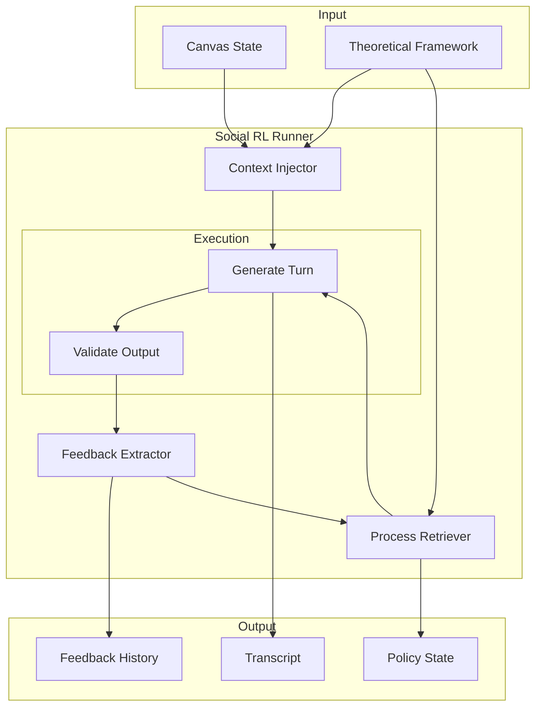

# Social RL Framework

Reinforcement learning through social interaction, where agents learn from social dynamics rather than explicit reward functions.

## Overview

The Social RL framework implements a learning paradigm where:

- **Process Retrieval serves as Policy**: PRAR schemas guide *how* agents reason, not *what* they say
- **Social Feedback serves as Reward**: Engagement, alignment, and contribution signals drive adaptation
- **Dynamic Context Injection**: Concept manifestations evolve per turn based on interaction history
- **Theoretical Grounding**: Framework constraints from the knowledge base prevent behavioral drift

This approach enables emergent learning without explicit reward functions or weight updates, instead leveraging the structure of social interaction itself.

## Architecture



## Components

### ContextInjector

Generates dynamic context for each turn, including concept manifestations that evolve based on conversation history and accumulated feedback.

```python
from social_rl import ContextInjector, create_context_injector_from_canvas

injector = create_context_injector_from_canvas(canvas)
context = injector.generate_turn_context(
    agent_id="Worker+Alice",
    round_number=1,
    turn_number=3,
    history=conversation_history,
    feedback=accumulated_feedback
)
```

**Key Classes:**
- `ContextInjector`: Main context generation engine
- `TurnContext`: Per-turn context frame with manifestations
- `TheoreticalFramework`: Framework configuration (concepts, theorists)
- `ManifestationType`: Context generation modes (static, progressive, reactive, adaptive)

### SocialFeedbackExtractor

Extracts learning signals from agent interactions, quantifying engagement, theoretical alignment, and contribution value.

```python
from social_rl import SocialFeedbackExtractor, create_extractor_for_framework

extractor = create_extractor_for_framework(framework)
feedback = extractor.extract_round_feedback(
    round_number=1,
    messages=round_messages,
    participants=agent_ids
)
```

**Feedback Dimensions:**
- `engagement_score`: Interaction participation level (0.0-1.0)
- `alignment_score`: Adherence to theoretical framework
- `contribution_score`: Substantive participation value
- `concept_markers`: Detected theoretical concept expressions

### ProcessRetriever

Retrieves PRAR-based reasoning policies that guide agent cognition. Policies adapt based on accumulated social feedback.

```python
from social_rl import ProcessRetriever, AdaptiveProcessRetriever

retriever = AdaptiveProcessRetriever(framework, feedback_threshold=0.3)
policy = retriever.retrieve_policy(role="Worker", feedback=agent_feedback)
cue = retriever.generate_rcm_cue(policy)
```

**Key Classes:**
- `ProcessRetriever`: Base policy retrieval
- `AdaptiveProcessRetriever`: Feedback-responsive policy adaptation
- `ReasoningPolicy`: Policy specification (reflect, connect, ask cues)
- `ProcessCue`: Individual reasoning cue with activation conditions

### SocialRLRunner

Main execution engine that orchestrates multi-agent rounds with integrated context injection, feedback extraction, and policy adaptation.

```python
from social_rl import SocialRLRunner, SocialRLConfig, create_social_rl_runner

config = SocialRLConfig(
    manifestation_mode="progressive",
    extract_feedback_per_turn=True,
    adapt_policies_per_round=True,
    use_prar_cues=True,
    use_coach_validation=True,
    coach_temperature=0.1,
    performer_temperature=0.7,
    verbose=True,
    auto_save=True,
    output_dir="outputs/"
)

runner = create_social_rl_runner(
    state_path="prar/outputs/2025-11-23_baseline_full_qwen/state.json",
    llm_client=llm,
    config=config
)

results = runner.execute_all_rounds()
print(runner.generate_report())
```

## Configuration

The `SocialRLConfig` dataclass controls execution behavior:

| Parameter | Type | Default | Description |
|-----------|------|---------|-------------|
| `manifestation_mode` | str | "progressive" | How context evolves: static, progressive, reactive, adaptive |
| `extract_feedback_per_turn` | bool | True | Extract feedback after each turn |
| `adapt_policies_per_round` | bool | True | Adapt reasoning policies between rounds |
| `use_prar_cues` | bool | True | Include PRAR reasoning cues in prompts |
| `use_coach_validation` | bool | True | Enable output validation |
| `coach_temperature` | float | 0.1 | Temperature for validation (low = strict) |
| `performer_temperature` | float | 0.7 | Temperature for generation (higher = creative) |
| `max_turns_per_round` | int | 15 | Maximum turns before round termination |
| `auto_save` | bool | True | Automatically save round results |
| `output_dir` | str | "outputs/" | Directory for output files |

## Output Format

Each round produces a JSON file with the following structure:

```json
{
  "round_number": 1,
  "round_config": {
    "scenario": "...",
    "rules": "...",
    "tasks": "..."
  },
  "messages": [
    {
      "agent_id": "Worker+Alice",
      "content": "...",
      "round_number": 1,
      "turn_number": 1,
      "timestamp": 1700000000.0,
      "turn_context": { ... },
      "prar_cue_used": "...",
      "feedback_snapshot": { ... }
    }
  ],
  "feedback": {
    "Worker+Alice": {
      "engagement_score": 0.85,
      "alignment_score": 0.72,
      "contribution_score": 0.68
    }
  },
  "policy_adaptations": [ ... ],
  "round_synthesis": "...",
  "duration_seconds": 45.2
}
```

## Current Implementation Status

| Component | Status | Notes |
|-----------|--------|-------|
| ContextInjector | Complete | All manifestation modes implemented |
| SocialFeedbackExtractor | Complete | Core metrics functional |
| ProcessRetriever | Complete | Adaptive retrieval working |
| SocialRLRunner | Complete | Single-client execution with validation |
| Coach/Performer separation | Partial | Validation logic in place; dual-client architecture planned |

The current implementation uses a single LLM client with temperature-based role differentiation and validation logic. A fully separated dual-LLM client architecture is planned for Phase 3 (see [ROADMAP.md](../ROADMAP.md)).

## Usage

### Quick Start

```bash
# From repository root
python run_social_rl_local.py
```

This script auto-detects available LLM backends (Ollama, OpenAI) and runs a Social RL session.

### Programmatic Usage

```python
import sys
sys.path.insert(0, '.')

from social_rl import create_social_rl_runner, SocialRLConfig
from local_rcm.llm_client import OpenAIClient

# Initialize LLM client
llm = OpenAIClient(
    base_url="http://localhost:8000/v1",
    model="Qwen/Qwen2.5-7B-Instruct"
)

# Create runner from PRAR state
runner = create_social_rl_runner(
    state_path="prar/outputs/2025-11-23_baseline_full_qwen/state.json",
    llm_client=llm,
    mode="progressive"
)

# Execute all rounds
results = runner.execute_all_rounds()

# Generate summary report
print(runner.generate_report())
```

## Theoretical Foundation

Social RL reframes traditional RL concepts in terms of social interaction:

| Traditional RL | Social RL Equivalent |
|---------------|---------------------|
| Environment | Other agents + theoretical constraints |
| State | Round context + concept manifestations |
| Action | Agent utterance/response |
| Reward | Social feedback (engagement, alignment, contribution) |
| Policy | PRAR process schemas |

This formulation enables studying emergent social dynamics under theoretically-grounded constraints, connecting computational methods to sociological frameworks (Weber, Marx, Tocqueville, Wollstonecraft).

## Directory Structure

```
social_rl/
├── __init__.py           # Package exports
├── runner.py             # SocialRLRunner, SocialRLConfig, execution logic
├── context_injector.py   # Dynamic context and manifestation generation
├── feedback_extractor.py # Social feedback extraction and metrics
├── process_retriever.py  # PRAR policy retrieval and adaptation
└── README.md             # This file
```

## See Also

- [ROADMAP.md](../ROADMAP.md) - Development phases and next steps
- [prar/README.md](../prar/README.md) - PRAR methodology foundation
- [agents/README.md](../agents/README.md) - Agent layer documentation
- [local_rcm/README.md](../local_rcm/README.md) - Orchestrator documentation
